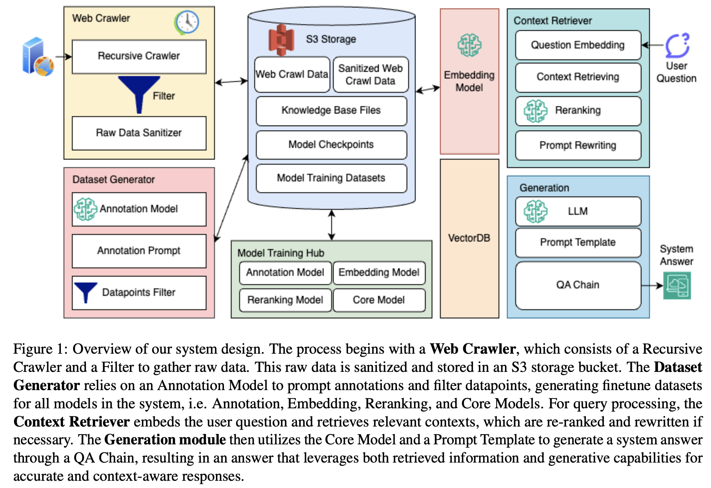

# Enhancing LLM Factual Accuracy with RAG to Counter Hallucinations: A Case Study on Domain-Specific Queries in Private Knowledge-Bases

**Jiarui Li\*, Ye Yuan\*, Zehua Zhang\***

\*Equal Contribution

---



---

This repository contains the implementation and dataset of our system designed to improve the factual accuracy of Large Language Models (LLMs) for domain-specific and time-sensitive queries, utilizing Retrieval Augmented Generation (RAG). Our approach focuses on countering the hallucination issue prevalent in LLMs, particularly when dealing with information from private knowledge bases.

## Abstract

We present an end-to-end system that leverages RAG to enhance the factual accuracy of LLMs. By integrating RAG with upstream dataset processing and downstream performance evaluation, we address the challenge of LLM hallucinations. Our system, refined through fine-tuning with a curated dataset from CMU's extensive resources, demonstrates improved accuracy in answering domain-specific and time-sensitive queries.

## Installation

Before running the project, ensure you have Python 3.8 or newer installed. It's recommended to use a virtual environment:

```bash
python -m venv venv
source venv/bin/activate  # On Windows, use `venv\Scripts\activate`
```

Install the required dependencies:

```bash
pip install -r requirements.txt
```

The requirements.txt should include torch, transformers, sentence_transformers, tqdm, peft, and any other libraries used in main.py.

## Usage

The main.py script is designed to be run from the command line with various arguments to control its behavior. Here is how you can use it:

```bash
python main.py --knowledge_base <path_to_knowledge_base> --test_set <path_to_questions> --groundtruth <path_to_answers>
```

```bash
python ${CODE}/src/main.py \
--topk 10 \
--reranker_topk 5 \
--generate_batch_size 16 \
--knowledge_base <path_to_knowledge_base> \
--cache_dir <path_to_cache_dir> \
--test_set <path_to_questions> \
--test_output <path_to_store_answers> \
--groundtruth <path_to_answers> \
--eval_num 512 \
--peft_model_id STEVENZHANG904/finetuned_llama2_chat_7b_hf_11711HW2 \
--embed_model_id YEthYuan/mxbai-embed-large-v1-finetuned-qa  \
> <path_to_stdout> 2>&1
```

### Key Arguments

- --knowledge_base: The path to the directory containing your knowledge base documents.
- --test_set: The path to the file containing test set questions.
- --groundtruth: The path to the file containing the corresponding ground truth answers for the test set.
- --topk: The maximum number of documents to retrieve for answering a question.
- --device: The device to run the model on, e.g., cuda for GPU.
  Refer to the script's argument parser section for a detailed explanation of all available options.

### Interactive Mode

To run the system in an interactive mode, where you can input questions directly and receive answers, simply omit the --test_set and --groundtruth arguments. Note: Interactive mode is marked as not implemented in the provided script, so some modifications might be needed to enable this feature.

## Components

The system integrates several key components:

- Embedding Model: Embeds input questions and documents into a high-dimensional space for efficient retrieval.
- Document Database: Stores and manages the knowledge base documents.
- Retriever: Retrieves the top-k most relevant documents based on the question embedding.
- Reranker: Further refines the relevance of the retrieved documents using a cross-encoder model.
- Question Answering Model: Generates answers based on the selected documents and the input question.

## Extending the System

This system is designed to be modular, allowing for easy swapping of components and integration of additional features, such as different models for embedding or reranking.

## Citation

Please cite our work if you find it useful in your research:

```
@article{li2024enhancing,
  title={Enhancing LLM Factual Accuracy with RAG to Counter Hallucinations: A Case Study on Domain-Specific Queries in Private Knowledge-Bases},
  author={Jiarui Li and Ye Yuan and Zehua Zhang},
  journal={arXiv preprint arXiv:2403.10446},
  Eprint = {arXiv:2403.10446},
  year={2024}
}

```

## Contact

For questions or feedback, please contact us at {jiaruil3, yeyuan3, zehuazha}@andrew.cmu.edu.
